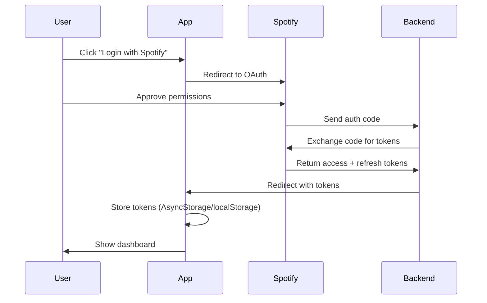

# 🎵 Spotify Wrapped Mobile

A beautiful, cross-platform mobile app that provides **real-time Spotify insights** - like Spotify Wrapped, but available year-round! Built with React Native, Expo, and TypeScript.


## Medium Article

([Check it out here](https://medium.com/@aaravmodi20/building-a-short-term-spotify-wrapped-taught-me-oauth-the-hard-way-3cab646ddcdc))

---

## 🎥 Demo


https://github.com/user-attachments/assets/025d1cfe-30ff-48ee-abb5-ca44b54f616a


---

## ✨ Features

🎧 **Real-time Music Stats**
- Total listening time
- Top tracks and artists
- Genre diversity analysis
- Skip rate tracking

💡 **Smart Insights**
- AI-powered listening pattern analysis
- Personalized music recommendations
- Playlist cleanup suggestions
- Genre exploration stats

📱 **Cross-Platform**
- iOS, Android, and Web support
- Unified authentication flow
- Responsive design

🔐 **Secure Authentication**
- OAuth 2.0 with Spotify
- Automatic token refresh
- Persistent sessions

---

## 🚀 Quick Start

### Prerequisites

- Node.js 18+ and npm
- Expo CLI (`npm install -g expo-cli`)
- Spotify Developer Account ([Sign up here](https://developer.spotify.com/dashboard))
- iOS Simulator (Mac) or Android Emulator (optional, can use Expo Go)

### Installation

1. **Clone the repository**
   ```bash
   cd smart-wrapped-mobile-wxffze
   ```

2. **Install dependencies**
   ```bash
   npm install
   ```

3. **Configure environment variables**
   
   Copy the example env file:
   ```bash
   cp env.example .env
   ```
   
   Update `.env` with your Spotify credentials:
   ```bash
   EXPO_PUBLIC_SPOTIFY_CLIENT_ID=your_client_id
   EXPO_PUBLIC_SPOTIFY_CLIENT_SECRET=your_client_secret
   ```

4. **Configure Spotify App**
   
   Go to [Spotify Developer Dashboard](https://developer.spotify.com/dashboard):
   - Create a new app
   - Add Redirect URIs:
     - `https://spotifywrapped.xo.je/callback.php` (or your backend URL)
     - `spotifywrapped://callback` (for mobile deep linking)
   - Copy Client ID and Client Secret to your `.env`

5. **Start the development server**
   ```bash
   npm run dev
   ```

6. **Run on your device/simulator**
   - **iOS**: Press `i` or run `npm run ios`
   - **Android**: Press `a` or run `npm run android`
   - **Web**: Press `w` or run `npm run web`
   - **Mobile Device**: Scan QR code with Expo Go app

---

## 📱 Tech Stack

### Core
- **React Native** 0.81.4 - Mobile framework
- **React** 19.1.0 - UI library
- **Expo** SDK 54 - Development platform
- **TypeScript** 5.8.3 - Type safety

### Navigation & Routing
- **Expo Router** 6.0 - File-based routing
- **React Navigation** 7.0 - Navigation library

### UI & Styling
- **React Native Reanimated** 4.1 - 60fps animations
- **Expo Linear Gradient** - Gradient backgrounds
- **Expo Symbols** - SF Symbols (iOS)
- **React Native Gesture Handler** - Touch gestures

### State & Storage
- **AsyncStorage** - Persistent storage (mobile)
- **LocalStorage** - Browser storage (web)
- React Hooks - Local state management

### Authentication
- **Expo Auth Session** - OAuth flows
- **Expo Web Browser** - In-app browser for OAuth
- Custom unified auth hook (`useSpotifyAuth`)

### API & Integration
- **Spotify Web API** - Music data
- Native Fetch API - HTTP requests

---

## 🏗️ Project Structure

```
smart-wrapped-mobile-wxffze/
├── app/                        # Expo Router pages (file-based routing)
│   ├── _layout.tsx            # Root layout
│   └── (tabs)/                # Tab navigation group
│       ├── (home)/            # Home tab stack
│       │   └── index.tsx      # Main dashboard
│       └── profile.tsx        # Profile tab
│
├── components/                 # Reusable UI components
│   ├── WrappedDashboard.tsx   # Main dashboard component
│   ├── FloatingTabBar.tsx     # Custom tab bar
│   ├── IconSymbol.tsx         # Icon wrapper
│   └── ...
│
├── hooks/                      # Custom React hooks
│   └── useSpotifyAuth.ts      # 🆕 Unified auth hook (web + mobile)
│
├── services/                   # Business logic & API
│   ├── spotifyApi.ts          # Spotify API wrapper
│   ├── spotifyAuth.ts         # Legacy auth (deprecated)
│   └── insightsEngine.ts      # Analytics & insights
│
├── utils/                      # Utility functions
│   ├── storage.ts             # 🆕 Cross-platform storage
│   └── errorLogger.ts         # Error logging
│
├── types/                      # TypeScript definitions
│   └── spotify.ts             # Spotify API types
│
├── config/                     # App configuration
│   └── spotify.ts             # Spotify config & scopes
│
├── styles/                     # Shared styles
│   └── commonStyles.ts        # Color palette & themes
│
├── constants/                  # App constants
│   └── Colors.ts              # Color definitions
│
└── contexts/                   # React contexts
    └── WidgetContext.tsx      # Widget state management
```

---

## 🔐 Authentication Flow

This app uses a **unified authentication hook** that works seamlessly across all platforms.

### How It Works



### Usage

```typescript
import { useSpotifyAuth } from '@/hooks/useSpotifyAuth';

function MyComponent() {
  const { 
    isAuthenticated, 
    login, 
    logout, 
    getAccessToken 
  } = useSpotifyAuth();

  // Login
  await login();

  // Get valid token (auto-refreshes if expired)
  const token = await getAccessToken();

  // Logout
  await logout();
}
```


---

## 🎨 Features Breakdown

### Dashboard Components

1. **Stats Grid**
   - Total listening time (minutes)
   - Top tracks count
   - Top artists count
   - Skip rate percentage

2. **Top Artists Carousel**
   - Horizontal scrollable list
   - Artist images in circular frames
   - Ranking badges

3. **Top Tracks List**
   - Track name and artist
   - Album artwork
   - Ranked by play count

4. **Smart Insights**
   - Personalized listening insights
   - Genre diversity analysis
   - Skip behavior analysis

5. **Recommendations**
   - Playlist cleanup suggestions
   - Artist discovery recommendations
   - AI-powered suggestions

---

## 📊 Spotify API Integration

### Available Endpoints

The app integrates with these Spotify Web API endpoints:

- `GET /v1/me` - Current user profile
- `GET /v1/me/top/tracks` - User's top tracks
- `GET /v1/me/top/artists` - User's top artists
- `GET /v1/me/player/currently-playing` - Currently playing track
- `GET /v1/me/player/recently-played` - Recently played tracks

### Time Ranges

All endpoints support these time ranges:
- `short_term` - Last 4 weeks
- `medium_term` - Last 6 months (default)
- `long_term` - All time

### Usage Example

```typescript
import { spotifyApi } from '@/services/spotifyApi';

const tokens = { accessToken, refreshToken, expiresAt };

// Get top tracks
const topTracks = await spotifyApi.getTopTracks(tokens, 'short_term');

// Get top artists
const topArtists = await spotifyApi.getTopArtists(tokens, 'medium_term');

// Get current user
const user = await spotifyApi.getCurrentUser(tokens);
```

---

## 🛠️ Development

### Scripts

```bash
# Start development server (with tunnel for mobile testing)
npm run dev

# Run on specific platform
npm run ios      # iOS simulator
npm run android  # Android emulator
npm run web      # Web browser

# Build for production
npm run build:web      # Web build
npm run build:android  # Android APK

# Code quality
npm run lint     # Run ESLint
```

### Environment Variables

All environment variables must be prefixed with `EXPO_PUBLIC_` to be accessible in the app:

```bash
EXPO_PUBLIC_SPOTIFY_CLIENT_ID      # Required
EXPO_PUBLIC_SPOTIFY_CLIENT_SECRET  # Required
EXPO_PUBLIC_BACKEND_URL            # Required
EXPO_PUBLIC_REDIRECT_URI           # Required
EXPO_PUBLIC_FRONTEND_URL           # Optional
EXPO_PUBLIC_SPOTIFY_API_BASE       # Optional
```

### Deep Linking

The app uses the scheme: `spotifywrapped://`

Test deep links:
```bash
# List registered schemes
npx uri-scheme list

# Test deep link (iOS)
npx uri-scheme open spotifywrapped://callback?access_token=test --ios

# Test deep link (Android)
npx uri-scheme open spotifywrapped://callback?access_token=test --android
```

---

## 🧪 Testing

### Manual Testing

1. **Web Testing**
   ```bash
   npm run web
   ```
   Open http://localhost:8081

2. **Mobile Testing (Development)**
   - Install Expo Go on your device
   - Run `npm run dev`
   - Scan QR code

3. **iOS Simulator**
   ```bash
   npm run ios
   ```

4. **Android Emulator**
   ```bash
   npm run android
   ```

### Test Checklist

- [ ] Login flow works on all platforms
- [ ] Tokens persist after app restart
- [ ] Token auto-refresh works
- [ ] Dashboard loads user data
- [ ] Stats calculations are accurate
- [ ] Insights are generated correctly
- [ ] Logout clears all data
- [ ] Deep linking works (mobile)
- [ ] OAuth callback works (web)

---

## 🚢 Deployment

### Web (Vercel/Netlify)

```bash
npm run build:web
# Upload dist/ folder to your hosting provider
```

### iOS (TestFlight/App Store)

```bash
# Install EAS CLI
npm install -g eas-cli

# Configure and build
eas build --platform ios
eas submit --platform ios
```

### Android (Play Store)

```bash
# Build APK/AAB
eas build --platform android

# Submit to Play Store
eas submit --platform android
```

---

## 🐛 Troubleshooting

### Common Issues

**1. "Cannot find module '@/...'"**
- Solution: Restart Metro bundler (`npm run dev`)

**2. "Invalid client" error during login**
- Solution: Check Spotify credentials in `.env`
- Verify redirect URI matches Spotify Dashboard

**3. Tokens not persisting**
- Solution: Clear app data and try again
- Check AsyncStorage/localStorage permissions

**4. Deep links not working (mobile)**
- Solution: Verify scheme in `app.json`
- Run `npx uri-scheme list`

**5. "Network request failed"**
- Solution: Check backend URL is accessible
- Verify CORS settings on backend

### Debug Mode

Enable debug logging:
```typescript
// In config/spotify.ts, add:
console.log('Debug mode enabled');
```

Check console for detailed logs during auth flow.

---

## 📝 API Rate Limits

Spotify API has rate limits:
- **User endpoints**: ~180 requests per minute
- **Token refresh**: No specific limit

Best practices:
- Cache API responses
- Implement request throttling
- Handle 429 (Too Many Requests) errors

---

## 🤝 Contributing

Contributions are welcome! Please follow these steps:

1. Fork the repository
2. Create a feature branch (`git checkout -b feature/amazing-feature`)
3. Commit your changes (`git commit -m 'Add amazing feature'`)
4. Push to the branch (`git push origin feature/amazing-feature`)
5. Open a Pull Request

---

## 📄 License

This project is licensed under the MIT License.

---

## 🙏 Acknowledgments

- [Spotify Web API](https://developer.spotify.com/documentation/web-api/)
- [Expo](https://expo.dev/)
- [React Native](https://reactnative.dev/)
- [React Navigation](https://reactnavigation.org/)

---

## 📧 Support

For questions or issues:
- Open an issue on GitHub
- Check the [Authentication Guide](./AUTHENTICATION.md)
- Review Spotify's [Web API docs](https://developer.spotify.com/documentation/web-api/)

---

## 🎯 Roadmap

- [ ] Add playlist management features
- [ ] Implement social sharing
- [ ] Add year-end Wrapped summary
- [ ] Support for multiple time ranges
- [ ] Offline mode with cached data
- [ ] Dark/light theme toggle
- [ ] Export stats as image/PDF

---

**Built with ❤️ using React Native + Expo**

